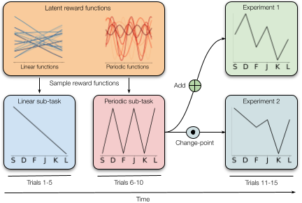

# Zero-shot compositional reinforcement learning in humans

Code and Data for "Zero-shot compositional reinforcement learning in humans".

  

## Abstract
People can easily evoke previously learned concepts, compose them, and apply the result to solve novel tasks on the first attempt. The aim of this paper is to improve our understanding of how people make such zero-shot compositional inferences in a reinforcement learning setting. To achieve this, we introduce an experimental paradigm where people learn two latent reward functions and need to compose them correctly to solve a novel task. We find that people have the capability to engage in zero-shot compositional reinforcement learning but deviate systematically from optimality. However, their mistakes are structured and can be explained by their performance in the sub-tasks leading up to the composition. Through extensive model-based analyses, we found that a meta-learned neural network model that accounts for limited computational resources best captures participants’ behaviour. Moreover, the amount of computational resources this model identified reliably quantifies how good individual participants are at zero-shot compositional reinforcement learning. Taken together, our work takes a considerable step towards studying compositional reasoning in agents – both natural and artificial – with limited computational resources.

### Data Availability
Data for experiments 1 and 2 are available in the `data` folder and can be loaded using the `pandas` library. 

### Code Availability
Code for the experiments is available in the `src` folder. 
`requirements.txt` contains the required python packages to run the code.

<!-- ## Requirements -->

<!-- ## Instructions to run the code -->

